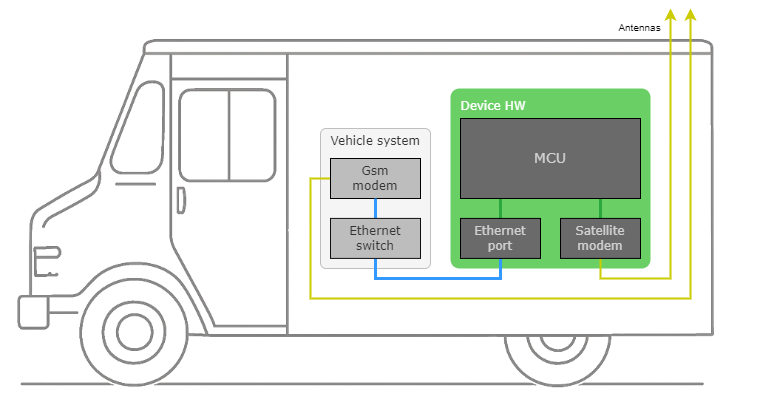
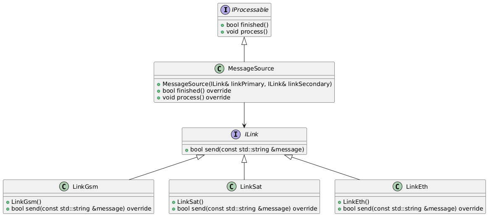

# *Broker*
*Broker* is an example application which demonstrates the basic functionality of *[diff](https://github.com/slawomir-niespodziany/diff)* framework.

# Description
*Broker* mocks firmware running in an edge device, which creates messages and sends them to a remote backend. It communicates using a pair of communication links. The hardware always provides two links (primary and backup), but their exact type is use case dependent. 
To ensure firmware maintainability, its architecture and implementation need to be easily adaptable for any use case (including ones arising in the future, not known up-front). 

### Use case A
A fleet management edge device consists of a cellular and satellite modems. It takes advantage of both low cost of cellular transmission and extended coverage provided by the satellite link. The image below depicts hardware setup for this use case.

### Use case B
A newer vehicle model is already equipped with internet connectivity. The fleet management device can be plugged into the system with an Ethernet cable. Such utilization of an existing hardware allows to siginificantly reduce device hardware cost. Below image depicts the setup for this use case.

# Solution
The right software architecture for such problem shall decompose it into small pieces and solve each independently. From there, Diff allows for a quick and efficient assembly of a solution tailored for each use case. 

### Software architecture
The following class diagram presents a hierarchy of Diff components, where each has one responsibility:
- **IProcessable** - (interface component) which allows the component to be processed (from e.g. main()) to perform its internal operations,
- **MessageSource** - generates messages to be sent,
- **ILink** - (interface component) defines sending interface for both the components which send messages (e.g. **MessageSource**) and components which provide sending functionality (e.g. **GsmLink**),
- **GsmLink** - sends messages over cellular network,
- **SatLink** - sends messages over satellite,
- **EthLink** - sends messages over ethernet cable.

Having these components implemented, various use cases can be now covered using Diff.

### Use case A - solution
